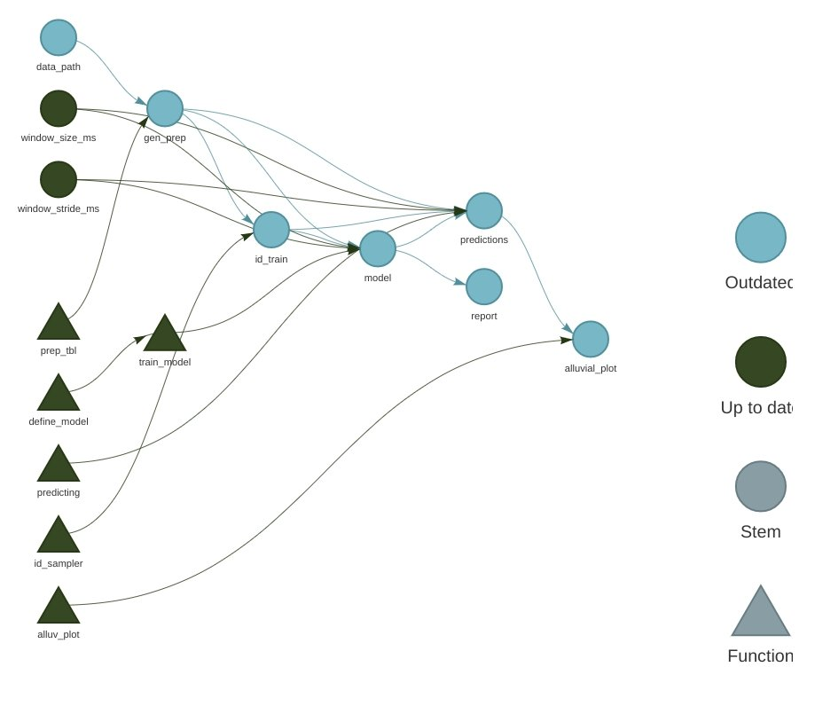
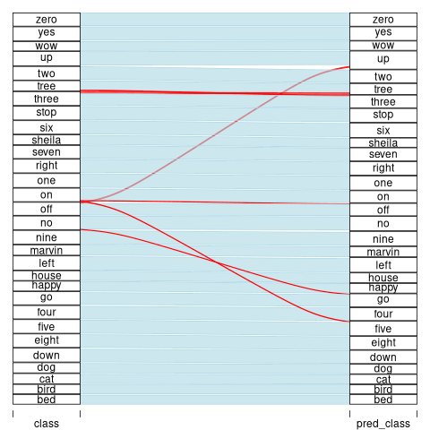

```{r, include = FALSE}
knitr::opts_chunk$set(
  collapse = TRUE,
  comment = "#>"
)
```

# Audio classification data pipeline with `targets` and `tensorflow`

The goal of this workflow is  build a deep learning model to classify words. We will use the [Speech Commands dataset](https://www.tensorflow.org/datasets/catalog/speech_commands) which consists of 65,000 one-second audio files of people saying 30 different words. Here fit multiple Keras models to the dataset with different tuning parameters, pick the one with the highest classification test accuracy, and produce a trained model for the best set of tuning parameters we find. This eample is based on [this](https://blogs.rstudio.com/ai/posts/2018-06-06-simple-audio-classification-keras/) and [this](https://blogs.rstudio.com/ai/posts/2019-02-07-audio-background/) blog post from the [RStudio AI Blog](https://blogs.rstudio.com/ai/) and the [targets-keras](https://github.com/wlandau/targets-keras) by W. Landau.

## The `targets` pipeline

The [`targets`](https://github.com/wlandau/targets) R package manages the workflow. It automatically skips steps of the pipeline when the results are already up to date, which is critical for machine learning tasks that take a long time to run. It also helps users understand and communicate this work with tools like the interactive dependency graph below.

```{r, eval = FALSE}
library(targets)
tar_visnetwork()
```



## How to access

You can try out this example project as long as you set up the following environment:

### Installation

1. Clone the repo
   ```sh
   git clone https://github.com/Humboldt-WI/dissertations/covariate_shift.git
   ```
2. Go to project directory
   ```sh
   cd ~/path/to/project/directory/covariate_shift
   ```   
3. Install required R packages
   ```sh
   Rscript setup/local.R --install
   ```
4. To run the code it is necessary to create a virtual environment for Python and TensorFlow. For doing so just run the following code:
  ```sh
  conda env create -f environment.yml
  ```
5. To downlaod the data, just run
  ```sh
   Rscript setup/get_data.R 
   ```
  
## How to run

In the R console, call the [`tar_make()`](https://wlandau.github.io/targets/reference/tar_make.html) function to run the pipeline or run the shell script:
   ```sh
   Rscript setup/get_data.R 
   ```

Then, call `tar_read(hist)` to retrieve the histogram. Experiment with [other functions](https://wlandau.github.io/targets/reference/index.html) such as [`tar_visnetwork()`](https://wlandau.github.io/targets/reference/tar_visnetwork.html) to learn how they work.

## File structure

The most important files in this example are organized as follows.

```{r, eval = FALSE}
├── run.sh
├── run.R
├── _targets.R
├── sge.tmpl
├── R/
├──── functions.R
├── data/
├──── speech_commands_v0.01
└── report.Rmd
```

File | Purpose
---|---
[`run.sh`](https://github.com/wlandau/targets-keras/blob/main/run.sh) | Shell script to run [`run.R`](https://github.com/wlandau/targets-keras/blob/main/run.R) in a persistent background process. Works on Unix-like systems. Helpful for long computations on servers.
[`run.R`](https://github.com/wlandau/targets-keras/blob/main/run.R) | R script to run `tar_make()` or `tar_make_clustermq()` (uncomment the function of your choice.)
[`_targets.R`](https://github.com/wlandau/targets-keras/blob/main/_targets.R) | The special R script that declares the [`targets`](https://github.com/wlandau/targets) pipeline. See `tar_script()` for details.
[`R/functions.R`](https://github.com/wlandau/targets-keras/blob/main/R/functions.R) | An R script with user-defined functions. Unlike [`_targets.R`](https://github.com/wlandau/targets-keras/blob/main/_targets.R), there is nothing special about the name or location of this script. In fact, for larger projects, it is good practice to partition functions into multiple files.
[`data/speech_commands_v0.01`](https://www.tensorflow.org/datasets/catalog/speech_commands) |  [Google](https://www.tensorflow.org/datasets/catalog/speech_commands) speech commands dataset (Warden 2018) The dataset consists of ~ 65,000 WAV files, of length one second or less. Each file is a recording of one of thirty words, uttered by different speakers.
[`report.Rmd`](https://github.com/wlandau/targets-keras/blob/main/report.Rmd) | An R Markdown report summarizing the results of the analysis. For more information on how to include R Markdown reports as reproducible components of the pipeline, see the `tar_render()` function from the [`tarchetypes`](https://wlandau.github.io/tarchetypes) package and the [literate programming chapter of the manual](https://wlandau.github.io/targets-manual/files.html#literate-programming).

<!-- ## Results -->

<!-- Many deep learning models are end-to-end, i.e. we let the model learn useful representations directly from the raw data. However, audio data grows very fast - 16,000 samples per second with a very rich structure at many time-scales. In order to avoid having to deal with raw wave sound data, researchers usually use some kind of feature engineering. -->

<!-- Every sound wave can be represented by its spectrum, and digitally it can be computed using the Fast Fourier Transform (FFT). -->

<!-- A common way to represent audio data is to break it into small chunks, which usually overlap. For each chunk we use the FFT to calculate the magnitude of the frequency spectrum. The spectra are then combined, side by side, to form what we call a spectrogram. -->

<!-- It’s also common for speech recognition systems to further transform the spectrum and compute the Mel-Frequency Cepstral Coefficients. This transformation takes into account that the human ear can’t discern the difference between two closely spaced frequencies and smartly creates bins on the frequency axis. -->

<!-- After this procedure, we have an image for each audio sample and we can use convolutional neural networks, the standard architecture type in image recognition models. -->

<!-- After data preprocessing (for more detailed specification see [here](https://blogs.rstudio.com/ai/posts/2018-06-06-simple-audio-classification-keras/#generator)) we definie the following model and train it: -->

<!-- ```{r, include=TRUE, eval=TRUE} -->
<!-- library(targets) -->
<!-- tar_read(model) -->
<!-- ``` -->

<!-- A nice visualization of the resulting confusion matrix is to create an alluvial diagram: -->

<!--  -->

<!-- We can see from the diagram that the most relevant mistake our model makes is to classify “tree” as “three”. There are other common errors like classifying “go” as “no”, “up” as “off”. At 93% accuracy for 30 classes, and considering the errors we can say that this model is pretty reasonable. -->

<!-- The saved model occupies 25Mb of disk space, which is reasonable for a desktop but may not be on small devices. We could train a smaller model, with fewer layers, and see how much the performance decreases. -->
